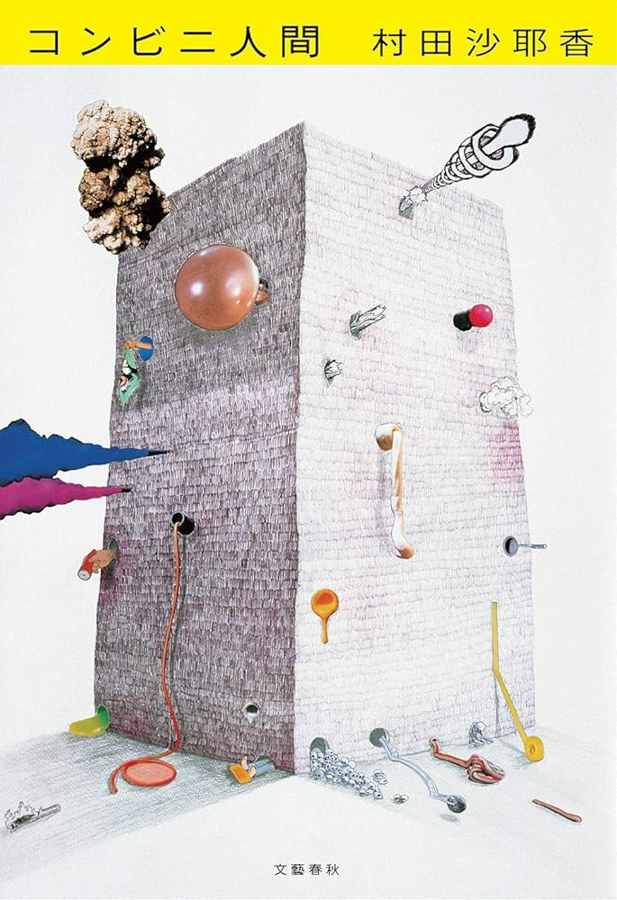

# Maybe We Should All Work in Convenience Stores: コンビニ人間

As much as everyone would like to see themselves as big boys and girls who make their own decisions, a lot of us just "end up" where we are. Read "Convenience Store Human" so that you too, can remember that you ain't hot stuff.

[{: width=300 }](https://amzn.asia/d/0dRL1pCl)

*Cover of Convenience Store Woman, written by Sanaka Murata*
{: .image-caption }

The story revolves around one Keiko Furukura ({古倉恵子|ふるくらけいこ}) who is a woman in her thirties working part time at a convenience store, and the people around her who can't mind their own goshdarn business thinks she should either: A. get married, or B. find a full-time job. On the other hand, Keiko feels as if convenience store feels like the only place where she can belong.

Spoilers ahead, and there will be some major quotes (that I've taken the liberty to translate) that I thought were especially impactful.

## The Average Homo Sapien

Keiko has a hard time finding her place in the world—except in the convenience store. There, she can feel like a cog in the machine. It gives her a semblance that the world has a coherent goal, that she is part of something greater.

But it's weird in Japan for a woman in her thirties to be an unmarried part-timer. It would probably raise some eyebrows in the land of AR-15's as well.

> 皆、変なものには土足で踏み入って、その原因を解明する権利があると思っている。
> Everyone thinks they have the right to figure out what's "wrong" with you when you act a bit different.

That's right, Keiko wants everyone to stop being such nosy neighbors. 

So what if your dream is to be a part-timer forever? Why should you get a better paying job? Or have kids? Or do anything?

It would be nice if people can offer some utility to the world before they get deleted, but should employee supply and demand and peer pressure decide what you do in life? Despite how much we value the individual, we don't always make our own choices.

Keiko's friends(?) and family are constantly trying to make her more "normal", but Keiko doesn't care because she's an absolute Chad. Most people do. We shave off parts of ourselves that make us different, so that the people around us don't point and laugh.

## Not Here to Stay

Despite finding her place in the convenience store, Keiko worries that one day the store won't need her. The world seems to revolve around ourselves, but the convenience store continues to sell onigiris even if it loses an employee or two.

As much as you and I will grieve for those around us, people just keep yappin' and eating burgers and driving their lifted F-150s.

> ［世界は］コンビニと一緒で、私たちは入れ替わっているだけで、ずっと同じ光景を続けているのかもしれない。 
> Maybe we'the world is just like a convenience store. The people change, but the earth continues to spin just like the day before. 

And in the moment those dang burger eaters and good-time-havers seem like the most evil people in the world. How dare they enjoy life while I'm suffering a tragedy? Do they not know I just lost my bookmark? Do they not remember that children are starving on the other side of the world? They should be mourning too!

Very apt, by the way. The convenience store stays the "same". It always sells the same snacks, the same water, the same mints. Technically, items are sold and restocked (except maybe those corn dogs on the grill in the US, who knows how long those have been there), but the store looks the same every time your visit.

The world continues to revolve around the sun without the dinosaurs. One day it'll revolve without us.

On a smaller scale, it'll revolve without Keiko or me and you. So I guess the goal really is just to have a good time.

> 本当に、ここは変わらないわねえ。 
> This place really doesn't change. — Some old woman in the book

## Conclusion

I liked the book. Pretty rad.

If you've ever experienced the feeling that everyone else is "part of the party" while you aren't, that's exactly how this book feels.

It's been translated to English as well, so please give it a read.
